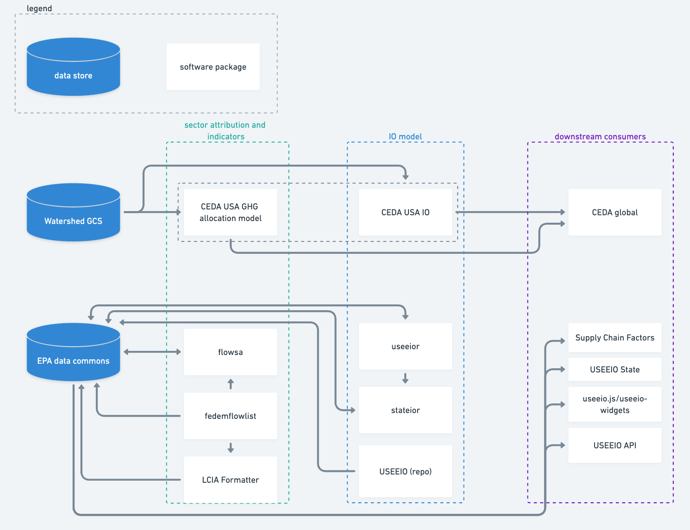
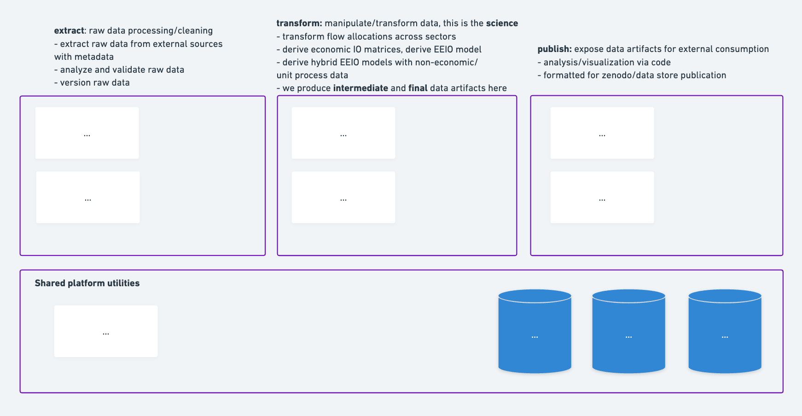
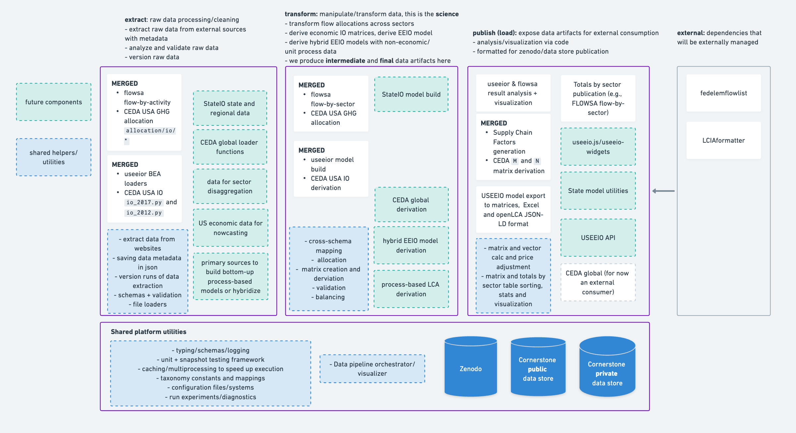
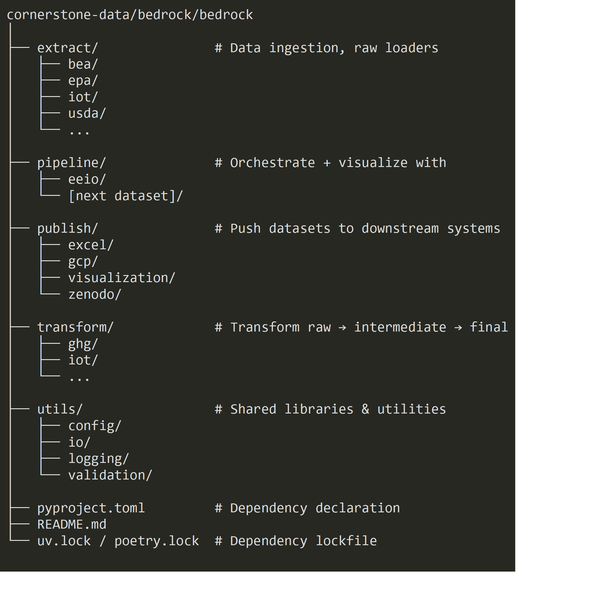

# Cornerstone Technical Architecture Vision

Cheng Lin, [cclin130](https://github.com/cclin130)  
Mo Li, [MoLi7](https://github.com/MoLi7)  
Ben Young, [bl-young](https://github.com/bl-young)  
Jorge Vendries, [jvendries](https://github.com/jvendries)  
Catherine Birney, [catherinebirney](https://github.com/catherinebirney)  
Wesley Ingwersen, [WesIngwersen](https://github.com/WesIngwersen)

# Table of contents

[Summary](#summary)

[Context and goals](#context-and-goals)

[Programming language choice](#programming-language-choice)

[Code architecture (current and future)](#code-architecture)

[Monorepo vs. polyrepo](#monorepo-vs-polyrepo)

[Mapping current architecture -> future architecture](#mapping-current-architecture-to-future-architecture)

[What this vision unlocks for the future](#what-this-vision-unlocks-for-the-future)

[Conclusion](#conclusion)

# Summary

This document proposes a vision for Cornerstone’s technical architecture: how we should structure our technical tools, systems, and workflows to achieve Cornerstone’s goal of developing high-quality, open sustainability data. 

The key points of this vision are:

1. Cornerstone will develop in Python.

2. Core Cornerstone code should be stored in a monorepo, allowing easy sharing of utilities, tools, standards, and data.

3. We should think of our EEIO (and future non-EEIO) data development as building an [ETL](https://aws.amazon.com/what-is/etl/), with clear code and workflow boundaries of: extracting data, transforming it (with the latest methodologies), and loading/publishing it.[^fn]

[^fn]: This analogy isn’t perfect, because we are not consolidating data into a single warehouse for business analytics, but is a useful framework for organizing and evolving our code to accelerate our work.

# Context and goals

Cornerstone’s goal is to develop high-quality, open sustainability data that will be the foundation for the carbon accounting and lifecycle assessment fields.

The primary function of the codebase in the near-term is to assemble models and produce usable data products from them, using the [USEEIO](http://www.useeio.org) and [CEDA](https://watershed.com/solutions/ceda) models as starting points. 
At minimum the models will include a national or international region level of resolution, a GHG emissions environmental extension and associated indicators, and monetary transactions. However, the model should be extendable to include subregional detail, non-GHG environmental extensions and indicators, and physical flows.

Our first 2026 release will be a global input-output-based model with a greenhouse gas emissions environmental extension (EEIO). 
Later, Cornerstone aims to publish US and state level models that are coupled with the core global model, with multiple environmental extensions and indicators, referencing USEEIO [v1](https://pubmed.ncbi.nlm.nih.gov/30344374/) and [v2](https://www.nature.com/articles/s41597-022-01293-7) as examples of the types of extensions that will be included.   

Cornerstone's technical architecture will serve the generation of the intermediate and final data assets for our models. We will develop our data assets via open sourced code (as opposed to spreadsheets, for example), for the following reasons in priority order:

1. Accelerate Cornerstone’s development of new datasets while ensuring quality and scientific rigour in our outputs.

2. Non-Cornerstone members can reproduce our work to verify its integrity.

3. Non-Cornerstone members can use and modify our software tools for their own use.

Note: (3) is the lowest priority because Cornerstone’s mission is first and foremost one of **open data**, as opposed to open source code libraries or software packages. This is reflected in the relative usage of the USEEIO/CEDA data outputs vs. code libraries. This tradeoff is reflected throughout this vision document.

# Programming language choice

We choose **Python** as our programming language of choice due to its prevalence in the field of industrial ecology and the modern frameworks and libraries available in the language to perform data extracting and transforming. Python offers industry-standard open source libraries for: data science, typing, schemas, testing, data storage access, and data pipeline orchestration.

This architecture vision does not get into which standards or preferred distributions and libraries within Python we will pick.
Cornerstone should decide on that as a group later on, and ensure those less familiar with Python are onboarded onto the best practices.

# Code architecture

## Current

The USEEIO team and the CEDA team both bring their own collection of repositories, tools, and data servers to Cornerstone. In terms of their function within the EEIO pipeline, they are most easily divided into code for sector attribution (or GHG allocation), IO model building, and downstream consumption (Figure 1).

Figure 1. Current technical architecture of CEDA (top) and USEEIO (bottom).

* For CEDA, the CEDA USA allocation and IO portions live in the same repository and share the same sets of utilities, development environment management, etc.

  * data is passed from one part of the code to another in-memory

* In contrast, for the [USEEIO modeling framework](https://github.com/cornerstone-data/useeio), each square is a separate repository and is an installable code package (except for the USEEIO, USEEIO-State and supply-chain-factors)

  * data is passed around either through a private Sharepoint (during development) or dumped into the EPA data commons and re-downloaded by the downstream code

## Proposed future

The existing EEIO code from both parties resemble immature [ETL (extract, transform, load)](https://aws.amazon.com/what-is/etl/) pipelines: the work of **extracting** raw data, applying EEIO methodologies as **transformations**, and **loading** the data to external servers/repositories is similar to typical ETL pipelines, with the exception that we load to multiple places instead of a single data warehouse.

**We should evolve our code into a mature ETL**. Using the language and frameworks of ETLs helps us organize our code, onboard new collaborators, rely on external ETL tooling to accelerate our development, and follow best practices in data engineering. It would accelerate Cornerstone’s mission to develop high-quality sustainability datasets by investing in the technical infrastructure to do so. Here are some ways in which our ETL-structured code can evolve as Cornerstone grows in its reach and scope:

1. **Extract**

   1. Versioning, scheduled runs with retries and monitoring.

   2. Shared tooling and infrastructure for data cleaning, schemas, diffing new vs. old data.

   3. Full test coverage of data cleaning logic with mock data.

2. **Transform**

   1. Easy development of transforms through strong schemas and interfaces with the **extract** step.

   2. Full test coverage of transformations with mock data.

3. **Publish (aka load)**

   1. Publishing process of intermediate and final data artifacts is programmatic rather than manual.

   2. Mature versioning and metadata of artifacts: every published dataset tagged with provenance info (source versions, transform version, pipeline run ID).

   3. Downstream notifications (Slack, email, dashboards) when new data releases are available.

4. **Cross-codebase data pipelining infrastructure**

   1. Revamp the “config/YAML” files with stricter patterns, typing, and stronger “code as source of truth” principles so they are easier to onboard onto.

   2. EF, customer impact, full economy production/consumption impact generated via one-click.

   3. Centralized observability: run history, lineage, and artifact versions across all data products.

   4. Out-of-the-box visualization of data pipeline directed acyclic graphs (DAGs) for non-technical users to understand data flows and transformations.

### **Monorepo vs. polyrepo**

It would be possible but difficult to execute on this across multiple repositories (a polyrepo), so our position is that the ETL should follow a **monorepo** approach, such that the code lives in one repository. A [monorepo](https://en.wikipedia.org/wiki/Monorepo) allows us to proliferate and enforce new patterns and tooling across the data pipeline, and is the most convenient way for Cornerstone contributors and external members to run the pipeline end-to-end. A monorepo ETL does not prevent us from publishing intermediate and final data artifacts for external consumption.

## **Mapping current architecture to future architecture**

We can first map the extract, transform, and publish buckets into the high-level jobs that USEEIO/CEDA code does today (Figure 2). 

Figure 2. High-level organization of Cornerstone’s future architecture.

Digging a level deeper, we can then categorize existing code into one of these three buckets or the `Shared platform utilities` bucket (Figure 3). Future code we’d want to add as Cornerstone expands can also be easily categorized.

Figure 3. Cornerstone’s future architecture with current and future modules organized into the extract, transform, load steps.

Most notably:

* FLOWSA, CEDA, `useeior`, and in the future, `stateior` would all be split into their **extract** logic and their **transform** logic.

* Consuming code such as the Supply Chain Factors, USEEIO-State, and `useeior` visualization and analysis would be considered **publish** steps.

* Components of USEEIO would be split into the appropriate **extract** and **transform** (nowcasting) or **publish** steps (olca) or moved to a separate repository if appropriate.

* We would invest in shared platform utilities that are accessible across the monorepo.

* Future Cornerstone data assets easily fall into extract, transform, and publish steps as well.

### Example file structure
Figure 4 shows how the files in a monorepo called `bedrock` could be structured.

Figure 4. Potential file structure of Cornerstone’s future monorepo.

* The *extract/transform/publish stages are explicit* to mirror how data actually flows, so onboarding and debugging are easier. Domain separation lives inside each stage.
* *orchestration of the pipeline has its own home* for easy understanding and dependency management.

# What this vision unlocks for the future

Putting down this foundation will first and foremost accelerate Cornerstone’s development of robust, well-managed sustainability data assets. We’ll be able to run the pipelines end-to-end for fast iteration loops in development, have stronger guarantees that no data is stale, and have compounding returns whenever we make a cross-codebase tooling improvement.

This vision is also exciting from a forward-looking perspective, because it unlocks several possibilities for Cornerstone’s future:

* **Easily develop new data assets beyond EEIO**

  * A strong foundation of ETL tools will allow us to quickly spin-up data development efforts beyond standard EEIO that are mature and robust from day one.

    * E.g., If we develop a process-based LCA dataset, we’ll have the same out-of-the-box helpers for data extraction, monitoring workflows, kicking off pipelines, versioning, etc.

    * Future data assets, such as hybrid EEIO and process-based LCAs may share sources of primary data. We can easily share extraction functions to do so (rather than sharing a data store, which risks data staleness).

* **Easily onboard technical contributors**

  * With the scope of changes limited to domain-specific extract, transform, and load files in a single repository, contributions from non-core members become easier to implement and easier to review.

    * Compare this to outside contributions that need to be coordinated across multiple repositories, or a single repo but the code is organized differently across each domain.

    * E.g., Our World in Data has fantastic documentation and tooling for adding your own dataset. Part of why this is so easy is because of their ETL structure: [https://docs.owid.io/projects/etl/guides/data-work/add-data/](https://docs.owid.io/projects/etl/guides/data-work/add-data/)

* **Easily show non-technical individuals how our models are derived**

  * Non-technical contributors can use code dependency visualizers such as [Basic](https://pycallgraph.readthedocs.io/en/master/examples/basic.html#generated-image) to understand the data flows and dependencies visually. This enables them to engage with our work and verify their understanding in ways USEEIO and CEDA don’t offer today. Based on demand, we can evolve this into something more mature (for inspiration, see the [Dagster web UI docs (click on the `Global asset lineage` tab)](https://docs.dagster.io/guides/operate/webserver?#assets)).

# Conclusion

This doc outlines a vision for Cornerstone’s technical architecture and lays out a high-level implementation plan for 2026\. Our top priorities for Cornerstone’s architecture is to accelerate the development of high-quality sustainability datasets. The best way to do this is to standardize our development in Python, in a monorepo, and following an ETL framework. Doing so will keep our 2026 EEIO development organized while setting us up for an exciting future where Cornerstone has a vibrant ecosystem of datasets and contributors.
